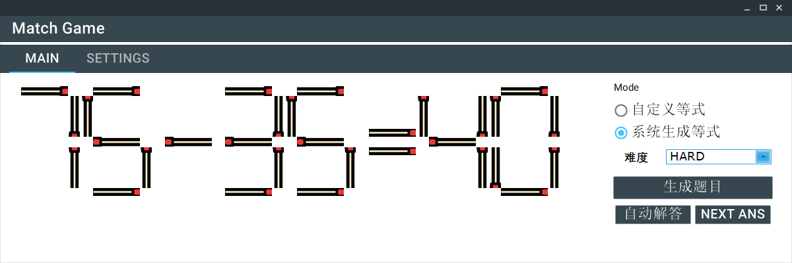
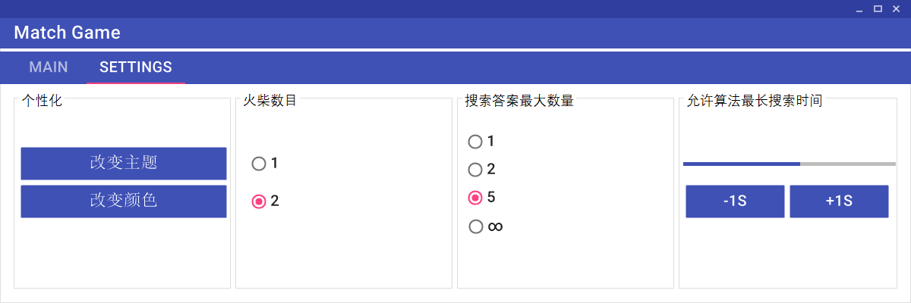

# Match
First Assignment of AI Project by Zhang Changshui @ Tsinghua

## Desciption
The program automatically generate or solve the `match equation puzzles` via Depth-First-Searching, where players aim to move single or multiple matches to make the equation.

## Demo



## Requirements
* Visual Studio 2015
* .NET Framework 4.6.1
* CSkin.dll (already included in the project) from [here](http://www.cskin.net/)
  - Version: CSkin 16.1.14.3/CSkin 4.0/CSkin.dll 
* MaterialSkin  (already included in the project) from [here](https://github.com/IgnaceMaes/MaterialSkin)
  - Version: 0.2.2
  - Could be accessed via `NuGet Package Manager` in Visual Studio

## Setup
* git clone this repo: 
```
git clone https://github.com/greatwallet/Match
```
* Open [`Match.sln`](Match.sln) in Visual Studio 2015
* Clean and Rebuild the solution
* Open the `Match.exe` in the `Match/bin/Debug` or `Match/bin/Release` folder.
* <b> Note: If you want to move the `Match.exe` in another path, make sure move it also with `CSkin.dll` and `MaterialSkin.dll`, otherwise it cannot be opened and run.  </b>

## Instructions on Files
Please refer to [FILE_INSTRUCTIONS.md](Match/FILE_INSTRUCTIONS.md), which provide details about how each of the `*.cs` file works.

## Portable EXE
You may try the program in [`Match.exe`](Match/bin/Release/Match.exe)

## Technical Report
Please check out [`report.pdf`](report.pdf)
